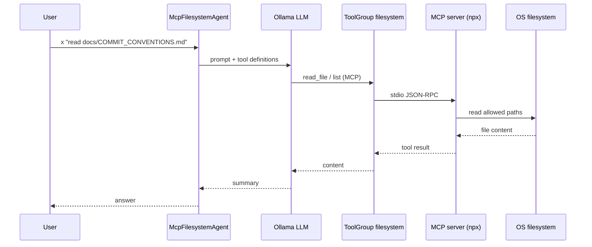
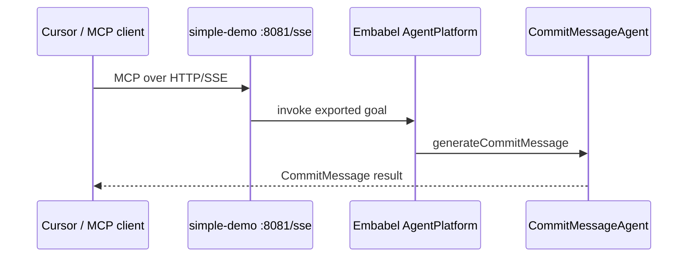

# Tutorial: MCP — consume & publish

Branch **`feat/tier4-mcp`**. Testing steps are in [README.md](README.md#testing-this-branch-feattier4-mcp).

This branch includes **everything** from [TUTORIAL-RAG.md](TUTORIAL-RAG.md) and [TUTORIAL-VECTOR-MEMORY.md](TUTORIAL-VECTOR-MEMORY.md), plus **Model Context Protocol (MCP)** integration.

## What is MCP?

Until tier 4, the demo talks to **git**, **Lucene**, and **Ollama** inside one JVM. Real assistants also need:

- **Tools outside the app** — filesystem, GitHub, browsers, databases (often run as separate MCP servers).
- **Exposure to IDEs** — Cursor, Claude Desktop, or other clients calling **your** agents as tools.

**MCP** is a standard wire format for both directions:

| Direction | This demo | Embabel concept |
|-----------|-----------|-----------------|
| **Consume** | LLM calls filesystem **read** tools via stdio MCP | `McpToolGroup` + `withToolGroup("filesystem")` |
| **Publish** | Remote client calls commit goals over **SSE** | `@Export(remote = true)` + `embabel-agent-starter-mcpserver` |

MCP is **optional** here: Spring **profiles** turn client/server on without breaking default `./mvnw spring-boot:run` or CI (`./mvnw test`).

## How this fits the full stack

```text
                    ┌─────────────────────────────────────┐
  Cursor / IDE      │  simple-demo (feat/tier4-mcp)       │
  (mcp-server) ────►│  SSE :8081  @Export remote goals   │
                    │                                     │
  npx filesystem ──►│  mcp profile: McpFilesystemAgent    │
                    │                                     │
                    │  CommitMessageAgent                 │
                    │    ← Lucene RAG (static docs)       │
                    │    ← vector memory (past commits)   │
                    │    ← git + Ollama LLM               │
                    └─────────────────────────────────────┘
```

| Layer | Still used on this branch? |
|-------|----------------------------|
| Lucene RAG | Yes — `rag-index`, `CommitStyleRetriever` |
| Vector memory | Yes — auto `remember` / `recallSimilar` |
| MCP consume | **`mcp` profile** — `McpFilesystemAgent` |
| MCP publish | **`mcp-server` profile** — HTTP server |

## Consume MCP (profile `mcp`)

### What happens at startup

1. Spring activates `application-mcp.properties`.
2. Spring AI MCP **client** spawns a stdio server:

```properties
spring.ai.mcp.client.stdio.connections.filesystem.command=npx
spring.ai.mcp.client.stdio.connections.filesystem.args=-y,@modelcontextprotocol/server-filesystem,${user.home}
```

3. `DemoMcpToolGroupsConfiguration` wraps MCP clients in an Embabel **`ToolGroup`** named `filesystem` (read-only tools whose names contain `"read"`).
4. **`McpFilesystemAgent`** (`@Profile("mcp")`) is registered; Autonomy can select it for file-read intents.

### What happens when you run `x`



```bash
SPRING_PROFILES_ACTIVE=mcp ./mvnw spring-boot:run
```

```text
embabel> x "read docs/COMMIT_CONVENTIONS.md and summarize commit rules"
```

The LLM must **call tools** — it should not invent file contents.

### Key code (consume)

| File | Role |
|------|------|
| `application-mcp.properties` | MCP client stdio connection |
| `config/DemoMcpToolGroupsConfiguration.java` | `McpToolGroup` → `filesystem` |
| `agent/McpFilesystemAgent.java` | `ai.withToolGroup("filesystem")` |

Optional **GitHub MCP** is documented in comments inside `application-mcp.properties` (Docker + `GITHUB_TOKEN`).

## Publish MCP (profile `mcp-server`)

### What happens at startup

1. `application-mcp-server.properties` sets `simple-demo.mcp-server.enabled=true`, `server.port=8081`, web app type **servlet**.
2. `McpServerEnableConfiguration` imports Embabel **`AgentMcpServerAutoConfiguration`** (excluded by default in `application.properties` so normal runs stay shell-only).
3. Goals annotated with **`@Export(remote = true)`** are advertised as MCP tools over **SSE**.

Exported in this project:

- `CommitMessageAgent.generateCommitMessage` — suggest commit from git state
- `CommitStyleAgent.explainCommitStyle` — conventions / RAG-style Q&A

### What happens when a client connects



```bash
SPRING_PROFILES_ACTIVE=mcp-server ./mvnw spring-boot:run
```

| Item | Value |
|------|--------|
| URL | `http://localhost:8081/sse` |
| Server type | `spring.ai.mcp.server.type=SYNC` |
| Interactive shell | **off** (`embabel.agent.shell.interactive.enabled=false`) |

**Cursor** (`~/.cursor/mcp.json`):

```json
{
  "mcpServers": {
    "simple-demo-commit": {
      "url": "http://localhost:8081/sse"
    }
  }
}
```

Restart Cursor after editing MCP config.

## How to test MCP (step by step)

**Important:** `./mvnw spring-boot:run` alone does **not** start MCP. You must set a Spring profile.

### Before you start (all MCP tests)

```bash
ollama pull gemma4:e4b
ollama pull nomic-embed-text
which npx          # must exist for consume profile
```

Run from the **repo root** (`simple-demo/`) so paths like `docs/COMMIT_CONVENTIONS.md` resolve.

---

### Test A — Consume filesystem MCP (`mcp` profile)

**What you are proving:** the app spawns the filesystem MCP server and the LLM can **read real files** via tools (not hallucinate).

**Terminal 1:**

```bash
cd /path/to/simple-demo
SPRING_PROFILES_ACTIVE=mcp ./mvnw spring-boot:run
```

**1. Check startup logs** (within ~30s):

- Ollama models OK (including 1 embedding).
- No fatal MCP / `npx` errors.
- Eventually Embabel deploys agents — you want **`McpFilesystemAgent`** in the list when you run `agents` in the shell.

**2. In the `embabel>` shell:**

```text
embabel> agents
```

Confirm **`McpFilesystemAgent`** appears (only registered when profile `mcp` is active).

**3. Run a file-read request** (use wording that asks to *read* a file):

```text
embabel> x "read the file docs/COMMIT_CONVENTIONS.md under this project and list three commit rules you found"
```

Use an **absolute path** if relative paths fail, e.g. `/Users/you/develop/embabel/simple-demo/docs/COMMIT_CONVENTIONS.md`. The filesystem server only allows paths under **`${user.home}`**.

**4. What success looks like**

- The answer quotes or paraphrases **real content** from that file (e.g. Conventional Commits, subject line rules).
- Logs may show tool calls / MCP activity during the run.

**5. What failure looks like**

| Symptom | Likely cause |
|---------|----------------|
| `McpFilesystemAgent` missing from `agents` | Profile not `mcp` — check `SPRING_PROFILES_ACTIVE=mcp` |
| Generic answer with no file specifics | Wrong agent chosen — make the prompt explicitly about **reading a file** |
| `npx` / MCP connection errors at startup | Install Node.js; run `npx -y @modelcontextprotocol/server-filesystem --help` manually |
| “Access denied” for a path | Path outside `${user.home}` — use a path under your home directory |

---

### Test B — Publish your agents as MCP server (`mcp-server` profile)

**What you are proving:** another program (e.g. Cursor) can call your **exported** commit goals over HTTP/SSE.

**Terminal 1** (only this app on 8081):

```bash
cd /path/to/simple-demo
SPRING_PROFILES_ACTIVE=mcp-server ./mvnw spring-boot:run
```

**1. Check startup logs**

- `Tomcat started on port 8081` (or similar).
- Lines like **`SYNC MCP Server initialization completed`** and **`Exposing N tools`** (N should be > 0 when agents are deployed).
- **No interactive `embabel>` shell** — that is expected for this profile.

**2. Quick sanity check** (optional):

```bash
curl -s -o /dev/null -w "%{http_code}" http://localhost:8081/sse
```

You may get `200` or the connection may stay open (SSE). **`Connection refused`** means the server is not up or wrong port.

**3. Connect from Cursor**

Edit `~/.cursor/mcp.json` (create if missing):

```json
{
  "mcpServers": {
    "simple-demo-commit": {
      "url": "http://localhost:8081/sse"
    }
  }
}
```

**Restart Cursor** (or reload MCP servers in settings). Open the MCP / tools panel and look for **`simple-demo-commit`** and tools derived from exported goals (commit message / style).

**4. Invoke from Cursor**

Use a prompt that should trigger the exported commit tooling, e.g. ask the agent to **propose a commit message** for current changes (exact UI depends on Cursor version).

**5. What failure looks like**

| Symptom | Likely cause |
|---------|----------------|
| Connection refused | App not running with `mcp-server` profile, or port blocked |
| Server starts but 0 tools exposed | Agents not deployed; check logs for Embabel agent scanning |
| Cursor shows server red / disconnected | Wrong URL — must be `http://localhost:8081/sse` |
| Embedding / Lucene errors at startup | Pull `nomic-embed-text`; only one JVM on Lucene index |

---

### Test C — Default shell (no MCP)

```bash
./mvnw spring-boot:run
```

Use this for **RAG + vector memory + commit agent** only. Confirms tier‑4 data features **without** MCP. Not a substitute for Test A or B.

---

### Can I run consume and publish together?

Not in one process with the current profiles: use **two terminals** — one with `mcp` (shell + filesystem client), one with `mcp-server` (HTTP server only). They are separate demos.

## Default profile (no MCP)

```bash
./mvnw spring-boot:run
```

Same as `feat/tier4-vector-memory`: `rag-index`, commit `x`, vector memory, chat — **no** `npx`, **no** port 8081.

```text
embabel> rag-index
embabel> x "generate a commit message for my current changes"
```

## Configuration reference

| Property / profile | Purpose |
|--------------------|---------|
| `spring.autoconfigure.exclude=…AgentMcpServerAutoConfiguration` | Keep MCP **server** off unless enabled |
| `simple-demo.mcp-server.enabled=true` | Enable server autoconfig (`mcp-server` profile) |
| `SPRING_PROFILES_ACTIVE=mcp` | MCP **client** + `McpFilesystemAgent` |
| `SPRING_PROFILES_ACTIVE=mcp-server` | MCP **server** on 8081 |

## Prerequisites checklist

| Requirement | Consume `mcp` | Publish `mcp-server` | Default shell |
|-------------|---------------|----------------------|---------------|
| Ollama + `gemma4:e4b` | yes | yes | yes |
| `nomic-embed-text` (exact tag) | yes (RAG/memory) | yes* | yes |
| `npx` | **yes** | no | no |
| Port 8081 free | no | **yes** | no |
| `rag-index` (recommended) | optional | optional | recommended |

\*Disable RAG/memory in properties if you only want to test MCP server without embeddings.

## Troubleshooting

| Problem | Fix |
|---------|-----|
| `McpFilesystemAgent` never runs | Activate `mcp` profile; phrase request as reading a file |
| MCP client fails at startup | Install Node/`npx`; check firewall; read Spring AI MCP logs |
| Port 8081 in use | Change `server.port` in `application-mcp-server.properties` |
| Cursor cannot connect | Server running with `mcp-server` profile; URL must end with `/sse` |
| Exported tools missing | Confirm `@Export(remote = true)` on goal methods; `simple-demo.mcp-server.enabled=true` |

## Tests

```bash
./mvnw test
```

`McpServerProfileTest` loads context with `@ActiveProfiles("mcp-server")` and RAG/memory disabled.

## Further reading

- [README.md](README.md) — three run modes
- [TUTORIAL-RAG.md](TUTORIAL-RAG.md) · [TUTORIAL-VECTOR-MEMORY.md](TUTORIAL-VECTOR-MEMORY.md)
- [Embabel guide](https://docs.embabel.com/embabel-agent/guide/0.5.0-SNAPSHOT/) — MCP client, MCP server, tool groups
