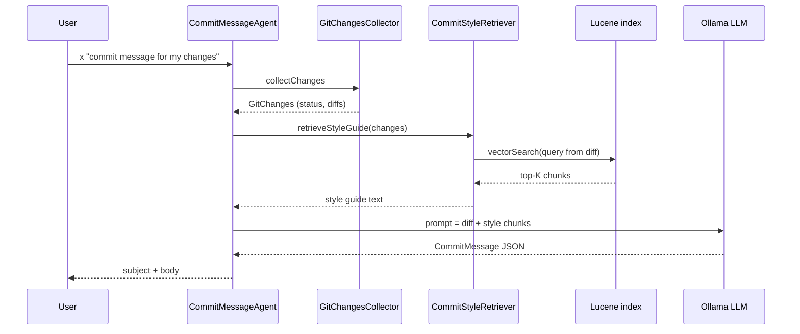
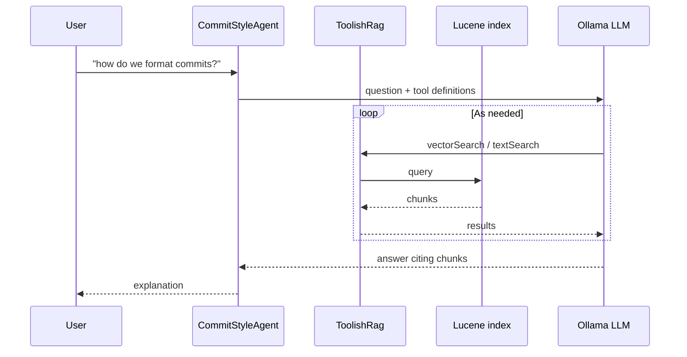
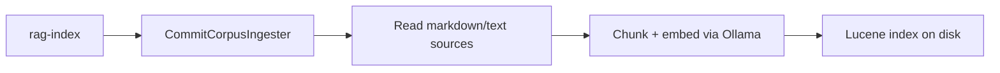

# Tutorial: RAG with Apache Lucene

Branch **`feat/tier4-rag`**. This demo uses **Retrieval-Augmented Generation (RAG)** backed by an on-disk **Apache Lucene** index (via Embabel’s `embabel-agent-rag-lucene` module). Hands-on testing steps are in [README.md](README.md#testing-this-branch-feattier4-rag).

## What is RAG?

Large language models only know what is in their **training data** and what you put in the **prompt**. They do not automatically know your team’s commit rules, internal docs, or past good examples in *this* repository.

**Retrieval-Augmented Generation (RAG)** closes that gap:

1. **Ingest** trusted sources (markdown, text files) into a **search index**.
2. When the user asks a question (or the agent runs a task), **retrieve** the most relevant passages.
3. **Augment** the LLM prompt with those passages, then **generate** the answer.

The model still does the writing; RAG supplies **grounded context** so answers follow your conventions instead of generic guesses.

### Embeddings (why not only keywords?)

**Vector search** converts text into numeric **embeddings** (vectors). Similar meaning → vectors close together, even when wording differs.

Example: a query about *“imperative subject line”* can match a doc chunk that says *“use the imperative mood in the subject”* without sharing exact keywords. This demo uses **Ollama** `nomic-embed-text` via Embabel’s `ModelProvider`.

**Keyword search** (classic Lucene full-text search) is also available through the same Embabel API; this project mainly uses **vector** retrieval for commit-style docs.

## Where Apache Lucene fits

**Yes — Lucene is the retrieval engine on this branch.** You will not see `org.apache.lucene.*` imports in `simple-demo`; Embabel wraps Lucene in **`LuceneSearchOperations`** (`com.embabel.agent.rag.lucene`).

| Layer | Technology | Role |
|-------|------------|------|
| Chunking & ingest | `CommitCorpusIngester`, Tika reader | Split markdown/text into chunks |
| Embeddings | Ollama `nomic-embed-text` | Turn chunk text and queries into vectors |
| **Index & search** | **Apache Lucene** (on disk) | Store chunks + vectors; run `vectorSearch` (and optional text search) |
| RAG orchestration | `CommitStyleRetriever`, `ToolishRag` | Call Lucene, pass results into prompts or LLM tools |
| Generation | Ollama `gemma4:e4b` | Write commit messages or answers |

Maven dependency: `embabel-agent-rag-lucene`. Spring creates one bean in `RagConfiguration`:

- Index directory: `simple-demo.rag.index-path` → default `~/.simple-demo/lucene-index` (real Lucene segment files after `rag-index`)
- Bean type: `LuceneSearchOperations` — used by `CommitCorpusIngester`, `CommitStyleRetriever`, and `CommitStyleAgent` (`ToolishRag`)

```text
  docs/*.md, rag-sources/*.txt
           │
           ▼  rag-index (embed + write)
  ┌────────────────────────────┐
  │  Apache Lucene index       │  ~/.simple-demo/lucene-index
  │  (chunks + vector fields)  │
  └─────────────┬──────────────┘
                │ vectorSearch / ToolishRag
                ▼
  CommitStyleRetriever / CommitStyleAgent
                │
                ▼  prompt augmentation
           Ollama LLM (gemma4:e4b)
```

Ollama does **not** store your docs — it only embeds and generates. **Lucene** is what remembers and finds the right passages.

## What this branch adds

`CommitMessageAgent` already sees **your current git diff**. It does **not** know how *this repo* wants commits written unless you tell it every time.

| Piece | Role |
|-------|------|
| **Corpus** | `docs/COMMIT_CONVENTIONS.md`, `TUTORIAL.md`, `rag-sources/past-commits.sample.txt` |
| **Lucene index** | On-disk store at `~/.simple-demo/lucene-index`; built by `rag-index` |
| **Lucene API in app** | `LuceneSearchOperations` (Embabel wrapper, not raw Lucene calls) |
| **Ingest** | `CommitCorpusIngester` → writes chunks into Lucene |
| **One-shot RAG** | `CommitStyleRetriever.vectorSearch(...)` → `CommitMessageAgent` prompt |
| **Agentic RAG** | `ToolishRag(searchOperations)` on `CommitStyleAgent` — LLM calls Lucene via tools |
| **Shell** | `rag-search` — Lucene `vectorSearch` only, no LLM |

## Two RAG patterns in this demo

### 1. One-shot RAG (commit message generation)

Retrieval runs **once**, before the LLM call. The application builds the prompt; the model does not call search tools.



**Code path:** `CommitMessageAgent.generateCommitMessage` → `commitStyleRetriever.retrieveStyleGuide(changes)`.

### 2. Agentic RAG (Q&A about conventions)

The LLM receives **tools** (`vectorSearch`, `textSearch` via `ToolishRag`) and decides **if** and **how often** to search while answering.



**Entry points:**

- `x "how do we format commits in this repo?"` (Autonomy picks `CommitStyleAgent`)
- `chat` → `ChatRouter` **STYLE** route (keywords like *convention*, *format commit*, *how … commit* without *generate*)

**Code path:** `CommitStyleAgent.explainCommitStyle` → `new ToolishRag(..., searchOperations)`.

### Index build (offline, once per corpus change)



After `rag-index`, both one-shot and agentic flows read the same index.

## Prerequisites

```bash
ollama pull gemma4:e4b
ollama pull nomic-embed-text
```

| Requirement | Purpose |
|-------------|---------|
| `gemma4:e4b` | Chat / commit generation (`embabel.models.default-llm`) |
| `nomic-embed-text` | Embeddings for Lucene vector fields (`embabel.models.default-embedding-model`) |
| Git | Commit agent collects diffs |

Ollama must expose at least one **embedding** model at startup. If you only have chat models, Spring fails while creating `LuceneSearchOperations` with `available models: []`.

## Configuration

| Property | Default | Purpose |
|----------|---------|---------|
| `embabel.models.default-llm` | `gemma4:e4b` | Commit / chat LLM |
| `embabel.models.default-embedding-model` | `nomic-embed-text:latest` | Embedding service for vectors |
| `simple-demo.rag.enabled` | `true` | Set `false` to skip RAG beans |
| `simple-demo.rag.index-path` | `~/.simple-demo/lucene-index` | Lucene directory |
| `simple-demo.rag.sources` | see `application.properties` | Comma-separated files to ingest |
| `simple-demo.rag.max-chunk-size` | `800` | Chunk size for ingestion |
| `simple-demo.rag.retrieval-top-k` | `3` | Chunks injected / searched |

## Hands-on

```bash
./mvnw spring-boot:run
```

```text
embabel> help
embabel> rag-index
embabel> rag-search --query "conventional commits subject"
embabel> x "generate a commit message for my current changes"
embabel> x "how do we format commits in this repo?"
embabel> chat
chat:> how do we format commits here?
```

`rag-search` is useful to debug retrieval without spending LLM tokens. Commands use Spring Shell’s `@ShellMethod` API (same as Embabel’s built-in `x`, `chat`, `agents`).

## Key code

| File | Role |
|------|------|
| `config/RagConfiguration.java` | `LuceneSearchOperations` bean (embeddings + index path) |
| `config/RagProperties.java` | Sources, chunk size, top-K |
| `rag/CommitCorpusIngester.java` | `rag-index` ingestion |
| `rag/CommitStyleRetriever.java` | One-shot vector search |
| `agent/CommitMessageAgent.java` | Injects retrieved style guide into prompt |
| `agent/CommitStyleAgent.java` | Agentic RAG with `ToolishRag` |
| `shell/RagShellCommands.java` | `rag-index`, `rag-search` |
| `chat/ChatRouter.java` | `STYLE` vs `COMMIT` routing |

## Chat routing (commit vs style)

| You type | Route | Agent |
|----------|-------|--------|
| *generate commit message*, *git*, *commit* (generate) | `COMMIT` | `CommitMessageAgent` (one-shot RAG in prompt) |
| *convention*, *format commit*, *how … commit* (not generate) | `STYLE` | `CommitStyleAgent` (agentic RAG) |
| *joke* | `JOKE` | `JokeAgent` |
| else | `GREETING` | `GreetingAgent` |

## Troubleshooting

| Problem | Fix |
|---------|-----|
| Embedding model not found at startup | `ollama pull nomic-embed-text`; confirm `ollama list` shows it |
| Empty `rag-search` / generic commit messages | Run `rag-index`; check sources exist |
| Lucene “no segments* file” at startup | Index not built yet — run `rag-index` once |
| Agent says run `rag-index` | Lucene index empty or `simple-demo.rag.enabled=false` |
| Style questions go to commit generator | Use wording that matches `ChatRouter.isStyleQuestion` (see table above) |
| `No command found for 'rag-index'` | Lucene bean missing, or commands not registered — restart after `ollama pull nomic-embed-text`; run `help` to confirm `rag-index` is listed |
| `Lock held by another program` on index | Another `spring-boot:run` still holds `~/.simple-demo/lucene-index/write.lock` — stop the other process |

## Tests

```bash
./mvnw test
```

`simple-demo.rag.enabled=false` in test `application.properties` — no Ollama embeddings required. `CommitStyleRetrieverTest` covers formatting of retrieved chunks.

## Further reading

- [README.md](README.md) — branch testing checklist
- [TUTORIAL.md](TUTORIAL.md) — baseline `x` / `chat` without RAG detail
- [Embabel guide](https://docs.embabel.com/embabel-agent/guide/0.5.0-SNAPSHOT/) — RAG, Lucene module, Agentic RAG, `ToolishRag`
- Next branch: **`feat/tier4-vector-memory`** (`TUTORIAL-VECTOR-MEMORY.md`) — semantic memory of past commit suggestions
