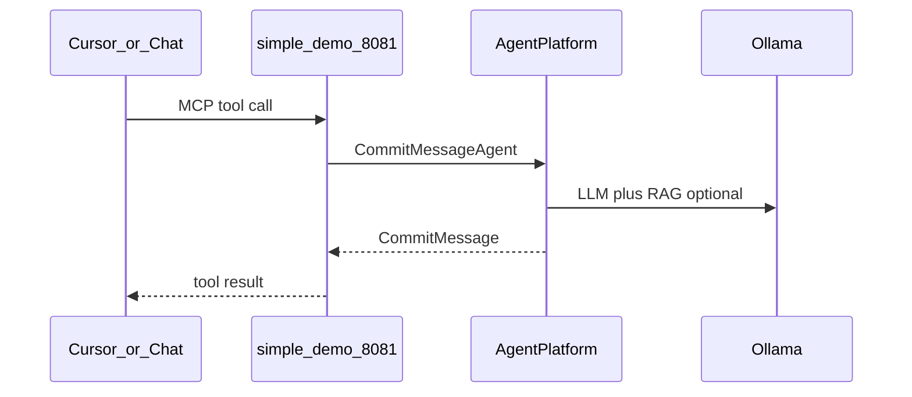

# Tier 4 — MCP (`feat/tier4-mcp`)

**Branch:** `feat/tier4-mcp` (full Tier 4: RAG + vector memory + MCP)  
**Tutorials:** 21 (consume MCP tools), 22 (publish as MCP server)

## Overview — why MCP?

Until now everything runs **inside** the JVM: git CLI, Lucene, Ollama. Real assistants also need **external systems** (issue trackers, browsers, other repos) and **IDE integration** (Cursor, Claude Desktop calling your agents as tools).

**Model Context Protocol (MCP)** standardizes both directions:

| Direction | Tutorial | What you learn |
|-----------|----------|----------------|
| **Consume** | 21 | Embabel **tool groups** backed by MCP clients (e.g. filesystem) |
| **Publish** | 22 | Expose `@Agent` goals as MCP tools over SSE for IDEs |

Default `./mvnw spring-boot:run` keeps the **interactive shell** only. MCP is opt-in via Spring profiles so CI and quick demos do not need Docker, `npx`, or a second HTTP port.



**Embabel guide:** MCP consuming, MCP server starter, tool groups.

## Checkout

```bash
git checkout feat/tier4-mcp
```

## Prerequisites

| Requirement | Tutorial |
|-------------|----------|
| RAG + embeddings | Optional but typical (run `rag-index` for richer commits) |
| Node `npx` | 21 — filesystem MCP server |
| Free port `8081` | 22 — MCP server profile |

## Key code

| File | Role |
|------|------|
| `application-mcp.properties` | MCP **client** (stdio filesystem) |
| `application-mcp-server.properties` | MCP **server** on port 8081 |
| `config/DemoMcpToolGroupsConfiguration.java` | `McpToolGroup` for filesystem reads |
| `config/McpServerEnableConfiguration.java` | Enables server autoconfig when flagged |
| `agent/McpFilesystemAgent.java` | Demo agent using `withToolGroup("filesystem")` |
| `CommitMessageAgent` / `CommitStyleAgent` | `@Export(remote = true)` for MCP tools |

## Tutorial 21 — Consume MCP tools

**Idea:** Configure Spring AI MCP **clients**; Embabel wraps them in a **tool group** the LLM can call safely.

```bash
SPRING_PROFILES_ACTIVE=mcp ./mvnw spring-boot:run
```

Uses `@modelcontextprotocol/server-filesystem` via `npx` (see `application-mcp.properties`). Optional GitHub MCP is commented there (`GITHUB_TOKEN` + Docker).

```text
shell:> x "read docs/COMMIT_CONVENTIONS.md and summarize commit rules"
```

`McpFilesystemAgent` is only active on the `mcp` profile and uses tool group role `filesystem`.

## Tutorial 22 — Publish as MCP server

**Idea:** Your agents become **tools** external clients invoke — same goals as shell `x`, different transport.

```bash
SPRING_PROFILES_ACTIVE=mcp-server ./mvnw spring-boot:run
```

| Setting | Value |
|---------|--------|
| SSE URL | `http://localhost:8081/sse` |
| Server type | `spring.ai.mcp.server.type=SYNC` |
| Exported goals | `@Export(remote = true)` on commit/style actions |

**Cursor** (`~/.cursor/mcp.json`):

```json
{
  "mcpServers": {
    "simple-demo-commit": {
      "url": "http://localhost:8081/sse"
    }
  }
}
```

Server autoconfig is excluded by default in `application.properties` and enabled when `simple-demo.mcp-server.enabled=true` (set in `application-mcp-server.properties`).

Shell is disabled in the `mcp-server` profile so the process acts as a headless tool server.

## Profiles summary

| Profile | Command | Behavior |
|---------|---------|----------|
| *(default)* | `./mvnw spring-boot:run` | Shell `x` / `chat`, RAG, vector memory |
| `mcp` | `SPRING_PROFILES_ACTIVE=mcp …` | + filesystem MCP client |
| `mcp-server` | `SPRING_PROFILES_ACTIVE=mcp-server …` | HTTP MCP server on 8081 |

## Tests

`McpServerProfileTest` loads the `mcp-server` profile with `server.port=0`. No live Cursor test in CI.

## Earlier Tier 4 topics

- [TUTORIAL-TIER4-RAG.md](TUTORIAL-TIER4-RAG.md) — tutorials 17–19  
- [TUTORIAL-TIER4-VECTOR-MEMORY.md](TUTORIAL-TIER4-VECTOR-MEMORY.md) — tutorial 20  

Parent index: [TUTORIAL-TIER4.md](TUTORIAL-TIER4.md).
