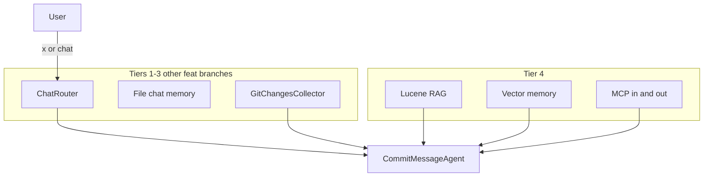

# Tier 4 — Overview

This file and the branch-specific guides below are on **`main`** so the roadmap is always visible. To run the demos, `git checkout` the **code branch** in each doc (implementation is not merged into `main` yet).

Tier 4 extends the commit assistant beyond **live git state** and **chat transcripts** (Tiers 1–3). It adds:

1. **Retrieval** — house rules and example commits from docs on disk (RAG).
2. **Semantic memory** — similar past suggestions without keyword search.
3. **MCP** — external tools in, agents exposed to IDEs out.

Each topic has its own branch and tutorial doc. Check them out in order so dependencies build naturally.

## How Tier 4 fits the bigger picture



| You already have (Tiers 1–3) | Tier 4 adds |
|------------------------------|-------------|
| Current branch, status, diffs | “What does *this repo* say about commit format?” |
| Conversation history on disk | “Have we suggested a commit like this before?” |
| Local `@Tool` on git | Read files / issues via MCP; expose agents to Cursor |

## Branch → tutorial doc

| Order | Branch | Doc | Tutorials |
|-------|--------|-----|-----------|
| 1 | `feat/tier4-rag` | [TUTORIAL-TIER4-RAG.md](TUTORIAL-TIER4-RAG.md) | 17–19 — Lucene RAG, agentic search, embeddings |
| 2 | `feat/tier4-vector-memory` | [TUTORIAL-TIER4-VECTOR-MEMORY.md](TUTORIAL-TIER4-VECTOR-MEMORY.md) | 20 — vector store for past commits |
| 3 | `feat/tier4-mcp` | [TUTORIAL-TIER4-MCP.md](TUTORIAL-TIER4-MCP.md) | 21–22 — consume and publish MCP |

```bash
git checkout feat/tier4-rag
# … work through TUTORIAL-TIER4-RAG.md …

git checkout feat/tier4-vector-memory
# … TUTORIAL-TIER4-VECTOR-MEMORY.md …

git checkout feat/tier4-mcp
# … TUTORIAL-TIER4-MCP.md (full stack) …
```

On `feat/tier4-mcp`, all three topics are present in one tree; earlier branches contain subsets.

## Shared prerequisites

| Requirement | Branches |
|-------------|----------|
| Java 21, `./mvnw` | All |
| Ollama `gemma4:e4b` | All |
| Ollama `nomic-embed-text` | RAG, vector-memory |
| Git | All (commit agent) |
| Node `npx` | MCP (consume profile) |

```bash
ollama pull gemma4:e4b
ollama pull nomic-embed-text   # before RAG / vector-memory
```

## Tests

```bash
./mvnw test
```

RAG and vector memory are off in `src/test/resources/application.properties`. `McpServerProfileTest` smoke-loads the `mcp-server` profile.

## Further reading

- [TUTORIAL.md](TUTORIAL.md) — Tiers 1–2 on `main` (shell `x`, chat, commit agent)
- [Embabel Agent Guide](https://docs.embabel.com/embabel-agent/guide/0.5.0-SNAPSHOT/)
