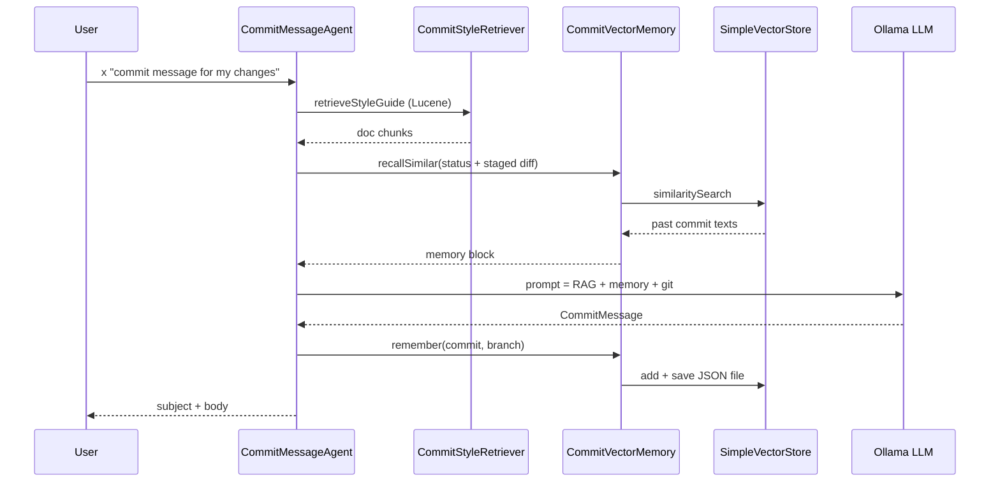

# Tutorial: Vector memory for past commits

Branch **`feat/tier4-vector-memory`**. Testing steps are in [README.md](README.md#testing-this-branch-feattier4-vector-memory).

This branch **builds on** [TUTORIAL-RAG.md](TUTORIAL-RAG.md) (Lucene over repo docs). You still need `rag-index` and `nomic-embed-text` for RAG; vector memory adds a **second** store for **your own past commit suggestions**.

## What is vector memory (here)?

**RAG** (this repo’s Lucene index) answers: *“What do our docs say about commit format?”* — static files you ingest with `rag-index`.

**Vector memory** answers: *“What commit messages did this app suggest before that were similar to **this** diff?”* — dynamic, grows every time `CommitMessageAgent` finishes.

| | Lucene RAG | Vector memory (`SimpleVectorStore`) |
|--|------------|--------------------------------------|
| **Source** | `COMMIT_CONVENTIONS.md`, tutorials, samples | Past `CommitMessage` outputs from the agent |
| **Store** | `~/.simple-demo/lucene-index` | `~/.simple-demo/vector-memory.json` |
| **Updated by** | Shell `rag-index` (manual rebuild) | Automatic `remember()` after each generation |
| **Retrieved by** | `CommitStyleRetriever` / `ToolishRag` | `CommitVectorMemory.recallSimilar()` |
| **Embeddings** | Embabel `ModelProvider` → Ollama | Spring AI `EmbeddingModel` → Ollama (same model) |

Other branches use different “memory” ideas:

| Branch | Memory type |
|--------|-------------|
| **`feat/memory`** | Full **chat transcript** files (what was said in `chat`) |
| **`feat/tier4-vector-memory`** (here) | **Semantic** recall of past **commit suggestions** only |
| **`feat/tier4-rag`** | **Docs** in Lucene, not past agent outputs |

## How it fits in `CommitMessageAgent`

Each `generateCommitMessage` run:

1. **Recall** — embed `git status` + staged diff (as text), search vector store for top‑K similar past suggestions.
2. **Augment** — add hits under `## Similar past commits (vector memory)` in the LLM prompt (alongside RAG style guide and git diffs).
3. **Generate** — Ollama `gemma4:e4b` returns `CommitMessage` JSON.
4. **Remember** — embed the new `subject` + `body` and append to the store, then **persist** JSON to disk.



No extra shell command — memory is **always on** when `simple-demo.vector-memory.enabled=true` and `SimpleVectorStore` is available.

## Where data is stored

| Path | Contents | Ephemeral? |
|------|----------|------------|
| `~/.simple-demo/vector-memory.json` | Spring AI `SimpleVectorStore` snapshot (vectors + document text) | **No** — survives restarts; loaded at startup |
| `~/.simple-demo/lucene-index/` | Lucene RAG index (separate) | **No** — see [TUTORIAL-RAG.md](TUTORIAL-RAG.md) |

At startup, `VectorMemoryConfiguration` calls `store.load(file)` if the JSON exists; otherwise it creates the parent directory.

Each `remember()` calls `vectorStore.save(...)` so the file updates after every successful suggestion.

## Prerequisites

Same as RAG, plus vector memory enabled by default:

```bash
ollama pull gemma4:e4b
ollama pull nomic-embed-text
```

```properties
# Embabel (Lucene RAG)
embabel.models.default-embedding-model=nomic-embed-text:latest

# Spring AI (SimpleVectorStore) — must match `ollama list` exactly
spring.ai.ollama.embedding.options.model=nomic-embed-text:latest

simple-demo.vector-memory.enabled=true
simple-demo.vector-memory.recall-top-k=3
```

`VectorMemoryConfiguration` is `@ConditionalOnBean(EmbeddingModel.class)` — if Spring AI cannot create an embedding client, vector memory stays off (`CommitVectorMemory.isActive()` is false) but the app may still run with RAG.

## Configuration

| Property | Default | Purpose |
|----------|---------|---------|
| `simple-demo.vector-memory.enabled` | `true` | Toggle recall + remember |
| `simple-demo.vector-memory.recall-top-k` | `3` | Max similar past commits in prompt |
| `simple-demo.vector-memory.storage-file` | `~/.simple-demo/vector-memory.json` | Persisted store (optional override) |
| `simple-demo.rag.enabled` | `true` | Lucene RAG (independent toggle) |

## Hands-on

```bash
./mvnw spring-boot:run
```

```text
embabel> rag-index
embabel> x "generate a commit message for my current changes"
embabel> x "generate a commit message for my current changes"
```

After the **first** run, check the file exists:

```bash
ls -la ~/.simple-demo/vector-memory.json
```

On the **second** run (similar changes help), inspect logs or LLM behavior — the prompt includes past suggestions when `recallSimilar` returns hits.

To reset memory:

```bash
rm ~/.simple-demo/vector-memory.json
# restart app or next remember() recreates store
```

## Key code

| File | Role |
|------|------|
| `memory/CommitVectorMemory.java` | `recallSimilar`, `remember`, `persist` |
| `config/VectorMemoryConfiguration.java` | `SimpleVectorStore` bean, load/save JSON |
| `config/VectorMemoryProperties.java` | `enabled`, `storageFile`, `recallTopK` |
| `agent/CommitMessageAgent.java` | Injects memory block; calls `remember` after LLM |
| `config/SpringAiVectorMemoryConfiguration.java` | Javadoc only — optional `VectorStoreChatMemoryAdvisor` pattern |

### `remember` (what gets stored)

```37:51:src/main/java/com/example/simpledemo/memory/CommitVectorMemory.java
  public void remember(CommitMessage commit, String repoId) {
    if (!isActive() || commit == null || commit.subject() == null || commit.subject().isBlank()) {
      return;
    }
    var text = commit.formatted();
    var document =
        new Document(
            text,
            Map.of(
                "type", "commit-suggestion",
                "repoId", repoId == null ? "default" : repoId,
                "subject", commit.subject()));
    vectorStore.add(List.of(document));
    persist();
```

Metadata includes `repoId` (git branch name from `changes.branch()`) for future filtering; recall currently searches the whole store.

### `recallSimilar` (query)

Uses `changes.status() + stagedDiff` as the similarity query (same idea as RAG’s diff-based query). Empty store → empty block → prompt unchanged.

## RAG + vector memory together

```text
  Static docs (rag-index)          Past suggestions (automatic)
         │                                    │
         ▼                                    ▼
   Lucene RAG                         vector-memory.json
         │                                    │
         └──────────► CommitMessageAgent ◄────┘
                           │
                           ▼
                      Ollama LLM
```

Use **RAG** for team conventions; use **vector memory** so repeated work in the same repo can echo prior good subjects you already generated.

## Optional: Spring AI chat advisor

`SpringAiVectorMemoryConfiguration` documents (does not wire) `VectorStoreChatMemoryAdvisor` on a separate `ChatClient` — for experiments comparing Embabel `chat` vs Spring AI–managed transcript memory. Enable with profile `spring-ai-memory` when you add `spring-ai-advisors-vector-store`. Embabel `chat` remains the primary demo path.

## Troubleshooting

| Problem | Fix |
|---------|-----|
| Never see “Similar past commits” | Run commit `x` at least once; ensure `vector-memory.enabled=true`; check JSON file grows |
| Memory always empty on recall | First run has nothing to recall; make second query resemble first diff text |
| RAG works, memory does not | Confirm `EmbeddingModel` bean / `spring.ai.ollama.embedding.options.model` |
| Stale bad suggestions remembered | Delete `vector-memory.json` and restart |

## Tests

```bash
./mvnw test
```

`CommitVectorMemoryTest` covers inactive memory and `remember` when store is absent. Integration tests disable vector memory in `application.properties`.

## Further reading

- [README.md](README.md) — branch testing checklist
- [TUTORIAL-RAG.md](TUTORIAL-RAG.md) — Lucene RAG on the same branch
- [TUTORIAL.md](TUTORIAL.md) — baseline `x` / `chat`
- Next: **`feat/tier4-mcp`** — `TUTORIAL-MCP.md`
