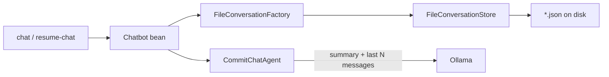

# Chat history and memory

This guide explains how **simple-demo** saves conversations to disk, how the LLM uses prior messages as **memory**, and which shell commands to use.

For the git commit message agent itself, see [TUTORIAL.md](TUTORIAL.md).

## Concepts

| Term | Meaning in simple-demo |
|------|-------------------------|
| **Chat history** | All messages stored in a conversation file on disk |
| **Memory (for the LLM)** | The last N messages from that history sent on each turn (`simple-demo.memory-max-messages`, default 20) |
| **Conversation** | Embabel’s `Conversation` type — explicit message list, not Spring AI `ChatMemory` |
| **Conversation id** | Short id (filename stem), e.g. `a1b2c3d4` — use with `resume-chat` |

Files are stored under:

```text
~/.simple-demo/conversations/<id>.json
```

Override with `simple-demo.conversations-dir` in `application.properties`.

History **survives** shell `exit` and app restarts. It is **not** shared across machines unless you copy that directory.

## Message windowing

**Chat history** (on disk) and **LLM context** (what the model sees on each turn) are not the same:

- **Saved:** every user and assistant message is written to the JSON file.
- **Sent to the LLM:** only the last **N** messages from that file, plus a system prompt (default **N = 20** via `simple-demo.memory-max-messages`).

`CommitChatAgent` calls `conversation.last(n)` before `createObject(...)`. That returns a short-lived view of the tail of the thread; replies are still appended to the **full** conversation and persisted. Older messages remain on disk but drop out of the model’s context once the thread is longer than N turns.

This is an application-level **message-count** cap. It is related to, but not the same as, a model’s **token** context window (e.g. 128k): if those N messages are very long, the provider can still reject or truncate the request. Raise N in `application.properties` if you need more recent turns in context.

## Session summarization

When `simple-demo.memory-summarization-enabled=true` (default) and the transcript is longer than the recent window, **older turns are compressed** before each reply:

1. Messages that fell out of the last-N window are sent to the LLM in a dedicated summarization call.
2. The result is stored in the conversation JSON as `sessionSummary`, with `summarizedThroughIndex` tracking how far summarization has progressed (incremental updates on later turns).
3. The main chat prompt becomes: **base system prompt** + **summary system block** + **last N verbatim messages**.

Full `messages[]` on disk is unchanged (audit and `resume-chat`). Disable summarization with `simple-demo.memory-summarization-enabled=false` to use windowing only.

## Quick start (two days)

**Day 1 — new chat**

```text
shell:> chat
You: What changed in my repo?
You: Suggest a conventional commit for the staged files
You: exit
```

Embabel’s built-in `chat` command uses our `Chatbot` bean. Each message is saved automatically to `~/.simple-demo/conversations/<id>.json`. Note the conversation id from the startup line (or list later).

**Day 2 — list and resume**

```text
shell:> conversations

ID         UPDATED           PREVIEW
a1b2c3d4   2026-05-20 10:15  Suggest a conventional commit for the staged files

shell:> resume-chat a1b2c3d4
You: Make the subject shorter
You: exit
```

The model sees a session summary (if any) plus the last N messages from that file (see [Message windowing](#message-windowing) and [Session summarization](#session-summarization)).

## Shell commands

| Command | Purpose |
|---------|---------|
| `chat` | Start a **new** interactive session (Embabel built-in; persists via file store) |
| `conversations` (alias `conv-list`) | List saved conversations |
| `resume-chat <id>` (alias `chat-resume`) | Continue a saved conversation |
| `x "..."` | One-shot **structured** commit JSON (`CommitMessageAgent`) — separate from chat history |
| `clear` | Clear shell blackboard (does not delete saved JSON files) |

### Workflow options

**1. Persistent chat (recommended for multi-day work)**

- Use `chat` for new threads, `conversations` + `resume-chat` to continue.
- Free-form assistant replies; good for exploring diffs and wording.

**2. One-shot commit JSON**

- Use `x "generate a commit message for my changes"`.
- No conversation file required; output is JSON `subject` / `body`.

**3. Same-session blackboard (`x -s`)**

- Re-runs an agent with the shell blackboard from the previous `x` in the **same** JVM session.
- Different from file-backed chat history; lost after restart unless you use `chat` / `resume-chat`.

## Configuration

```properties
simple-demo.conversations-dir=${user.home}/.simple-demo/conversations
simple-demo.memory-max-messages=2
simple-demo.memory-summarization-enabled=true
```

| Property | Default | Role |
|----------|---------|------|
| `simple-demo.conversations-dir` | `~/.simple-demo/conversations` | Where JSON files are written |
| `simple-demo.memory-max-messages` | `20` | Recent verbatim messages sent to the LLM per turn |
| `simple-demo.memory-summarization-enabled` | `true` | Summarize older turns into `sessionSummary` when the window is exceeded |

## How it works internally



1. **`FileConversationFactory`** — `load(id)` reads JSON; `create(id)` wraps an in-memory conversation.
2. **`PersistingConversation`** — saves to disk after every `addMessage`.
3. **`CommitChatAgent`** — may refresh `sessionSummary` via `SessionSummaryService`, then sends base system prompt, optional summary block, and `conversation.last(memoryMaxMessages)` to the LLM.
4. **`ChatConfiguration`** — registers `AgentProcessChatbot` wired to the **Commit chat** agent only.
5. **`AgentProcessChatSession`** — adds user messages to the conversation and runs the agent; assistant replies are appended and persisted.

## Embabel guide mapping

- [Building Chatbots (§4.13)](https://docs.embabel.com/embabel-agent/guide/0.5.0-SNAPSHOT/) — `Conversation`, `Chatbot`, `conversationId` on `createSession`.
- Production Embabel apps often use **`embabel-chat-store`** (Neo4j). This demo uses **file JSON** with the same `ConversationFactory.load` / `create` contract.

## Spring AI comparison

| Spring AI | simple-demo |
|-----------|-------------|
| `InMemoryChatMemoryRepository` | JSON files under `~/.simple-demo/conversations` |
| `MessageWindowChatMemory` | Full history on disk; LLM prompt uses session summary + last N messages |
| `conversationId` | Conversation id + `resume-chat` |

## Testing summarization

### Automated (no Ollama)

Unit tests cover the pipeline without a live LLM:

| Test | What it verifies |
|------|------------------|
| `ConversationSummarizationPlannerTest` | Which messages are selected when the window is exceeded |
| `ChatPromptBuilderTest` | Summary system block + recent messages in the prompt |
| `SessionSummaryServiceTest` | Summarization call via Embabel `FakeOperationContext`, state persisted to JSON |
| `FileConversationStoreTest` | `sessionSummary` / `summarizedThroughIndex` round-trip on disk |

Run:

```bash
./mvnw test
```

`SessionSummaryServiceTest` uses `FakeOperationContext.expectResponse(...)` so the summarizer returns a fixed string and assertions stay deterministic.

### Manual (with Ollama)

Use a **small window** so compaction happens quickly:

```properties
simple-demo.memory-max-messages=2
simple-demo.memory-summarization-enabled=true
```

1. Start the app and run `chat`.
2. Send **a few exchanges** (with `memory-max-messages=2`, summarization starts once there are more than two messages in the thread).
3. Exit and inspect the conversation file (replace `<id>` with the session id from `conversations`, e.g. `loving_shockley`):

```bash
cat ~/.simple-demo/conversations/<id>.json | jq '.sessionSummary, .summarizedThroughIndex, (.messages | length)'
```

Requires [jq](https://jqlang.org/). Example output when summarization has run:

```text
"The discussion's focus remains on ..."
6
10
```

Meaning: non-empty summary, last summarized message index, and total messages on disk. To view the full JSON:

```bash
cat ~/.simple-demo/conversations/<id>.json
```

You should see:

- `messages` — full transcript (all turns).
- `sessionSummary` — non-empty prose after the thread exceeds the window.
- `summarizedThroughIndex` — index of the last message folded into the summary.

4. `resume-chat <id>` and ask something that depends on an **early** topic (e.g. “what did we decide about the commit prefix?”). The model should still answer from the summary block even though early verbatim turns are no longer in the last-N window.

To compare window-only behavior, set `simple-demo.memory-summarization-enabled=false` and repeat; old topics should be harder to recover once they fall outside the last N messages.

## Troubleshooting

| Problem | What to check |
|---------|----------------|
| `Agent Commit chat has no goals` | `CommitChatAgent` must use `PlannerType.UTILITY` (adds the synthetic Nirvana goal for open-ended chat) |
| Chat stuck after you type a message | Same as above — GOAP cannot plan chat turns; use UTILITY on both the `@Agent` and `Chatbot` bean |
| Empty `conversations` list | Run `chat` at least once; verify `simple-demo.conversations-dir` exists and is writable |
| `resume-chat` says not found | Typo in id; run `conversations` for exact ids |
| Corrupt JSON | Delete the broken `*.json` file or fix JSON manually |
| No LLM reply | Ollama running at `spring.ai.ollama.base-url`; model pulled (`gemma4:e4b`) |
| `InvalidLlmReturnFormatException` on `x` (rankings JSON) | Harmless retry noise from Ollama/gemma; agent selection usually succeeds on the second attempt |

## FAQ

**Is history lost when I exit the shell?**  
No. Messages are saved after each turn. Start the app again and use `resume-chat <id>`.

**How do I start fresh?**  
Run `chat` (new session, new id). Old files remain until you delete them from the conversations directory.

**Does `x` use chat history?**  
Not by default. `x` targets `CommitMessageAgent` for structured JSON. Use `chat` / `resume-chat` for conversational memory.

**Can I delete a conversation?**  
Remove the file `~/.simple-demo/conversations/<id>.json`.
