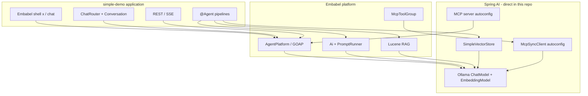

# How Embabel and Spring AI fit together

This repo is an **Embabel** application that runs on **Spring Boot** and uses **Spring AI** as the portable model and integration layer underneath. You rarely call Spring AI APIs directly in agent code; Embabel adds planning, typing, and enterprise structure on top.

**Related docs:** [SPRING_AI_REFERENCE_TOPICS.md](SPRING_AI_REFERENCE_TOPICS.md) · [SPRING_AI_GUIDE_COVERAGE.md](SPRING_AI_GUIDE_COVERAGE.md) · [EMBABEL_AGENT_GUIDE_TOPICS.md](EMBABEL_AGENT_GUIDE_TOPICS.md) · [GUIDE_COVERAGE.md](GUIDE_COVERAGE.md)

---

## Roles at a glance

| Layer | Responsibility | In simple-demo |
|-------|----------------|----------------|
| **Spring Boot** | App lifecycle, DI, web, profiles, config | `SimpleDemoApplication`, REST, `application*.properties` |
| **Spring AI** | Portable **ChatModel**, **EmbeddingModel**, **VectorStore**, **MCP** client/server autoconfig, Ollama wiring | `spring.ai.*` properties; `SimpleVectorStore`, `EmbeddingModel`; MCP STDIO/SSE |
| **Embabel** | **Agents** (`@Agent` / `@Action`), **GOAP** planning, **Ai** / structured output, **tool loop**, **RAG** (Lucene), **chatbot**, **shell**, **MCP tool groups** | All `agent/`, `chat/`, `rag/`, Embabel shell commands |

Think of Spring AI as the **“ JDBC of LLMs ”** (connections, drivers, primitives) and Embabel as the **application framework** (workflows, goals, domain model, production patterns).

---

## What Spring AI provides (and Embabel consumes)

Embabel’s Ollama starter and platform stack build on Spring AI’s model abstractions. In practice:

1. **Model access** — Chat and embedding calls go through Spring AI–backed clients (configured via `spring.ai.ollama.*` and Embabel’s `embabel.models.*` aliases).
2. **MCP transport** — Spring AI Boot starters discover `McpSyncClient` beans; Embabel wraps them in **`ToolGroup`** / **`McpToolGroup`** for the agent tool loop ([TUTORIAL-MCP.md](../TUTORIAL-MCP.md)).
3. **Embeddings & vector storage** — Where this demo uses Spring AI **directly**, it is for **`SimpleVectorStore`** + **`EmbeddingModel`** in [CommitVectorMemory](../src/main/java/com/example/simpledemo/memory/CommitVectorMemory.java) ([TUTORIAL-VECTOR-MEMORY.md](../TUTORIAL-VECTOR-MEMORY.md)), parallel to Embabel’s Lucene RAG path.

Embabel does **not** replace Spring AI’s `ChatModel`; it orchestrates **when** and **how** the model is invoked inside **actions**, **tool loops**, and **chat** flows.

---

## What Embabel adds on top

These concerns are **above** Spring AI’s reference scope—they are why you use Embabel for agentic apps:

| Embabel capability | Spring AI alone |
|--------------------|-----------------|
| **GOAP / utility planning** — pick and order `@Action`s toward `@AchievesGoal` | You wire prompts and tools yourself per request |
| **Typed blackboard** — `GitChanges` → `CommitMessage` between steps | Unstructured strings or ad-hoc maps |
| **Domain + DICE** — rich types, `@LlmTool` on domain objects | `@Tool` on services; no agent process model |
| **`Ai` / `createObject()` / Jinja** — structured generation in actions | `ChatClient` + converters (similar, but not process-scoped) |
| **Autonomy** — `x` picks the right `@Agent` | Single chat pipeline |
| **Agent process + REST/SSE** — `AgentPlatform`, process ids | No first-class “agent run” lifecycle |
| **Lucene RAG module** — `ToolishRag`, ingest, vector+keyword | `QuestionAnswerAdvisor` / modular RAG advisors |
| **Embabel shell** — `x`, `chat`, `rag-index`, custom commands | No interactive agent shell |
| **Chatbot + file memory** — `Conversation`, router utility actions | `ChatMemory` advisors on `ChatClient` |
| **MCP server publishing** — expose agents as MCP tools | MCP server starters only |

Official Embabel guide §4.22 states the relationship explicitly: Embabel is built on **Spring and Spring AI** for DI, portability, and production deployment on the JVM.

---

## How simple-demo splits the two stacks

### Typical request: `x "generate a commit message"`

1. **Embabel** — Autonomy selects `CommitMessageAgent`; GOAP runs actions (`collectGitChanges` → `generateCommitMessage`).
2. **Embabel RAG** — `CommitStyleRetriever` queries the **Lucene** index (Embabel module, Ollama embeddings via Embabel `ModelProvider`).
3. **Spring AI** — `CommitVectorMemory` may **recall/remember** via **`SimpleVectorStore`** (same Ollama embedding model, `spring.ai.ollama.embedding.*`).
4. **Embabel `Ai`** — Builds prompt (Jinja + DICE context), calls LLM, parses **`CommitMessage`** JSON.
5. **Spring AI** — Under the hood, chat completion uses the autoconfigured **Ollama** `ChatModel`.

### Typical request: `chat` (profile default)

1. **Embabel** — `AgentProcessChatbot` + **utility planner** routes to `ChatRouter` actions.
2. **Embabel** — `PersistingConversation` / file store ([TUTORIAL-MEMORY.md](../TUTORIAL-MEMORY.md)) — not Spring AI `ChatMemory`.
3. **Embabel `Ai`** — Reply generation; optional summarization planner.

### Profile `mcp`

1. **Spring AI** — STDIO MCP client to `@modelcontextprotocol/server-filesystem` (`spring.ai.mcp.client.*`).
2. **Embabel** — `DemoMcpToolGroupsConfiguration` exposes read-only tools as **`filesystem`** tool group for agents.

### Profile `mcp-server` / `api`

1. **Spring AI** — MCP server transport (`spring.ai.mcp.server.*`) or HTTP stack.
2. **Embabel** — Publishes agents / process status over platform REST+SSE ([TUTORIAL-REST.md](../TUTORIAL-REST.md)).

---

## Configuration: two property namespaces

| Prefix | Owned by | Examples in this repo |
|--------|----------|------------------------|
| `spring.ai.*` | Spring AI autoconfig | `spring.ai.ollama.base-url`, `spring.ai.ollama.embedding.options.model`, `spring.ai.mcp.client.*`, `spring.ai.mcp.server.type` |
| `embabel.*` | Embabel platform | `embabel.models.default-llm`, `embabel.models.default-embedding-model`, `embabel.agent.platform.*`, shell flags |

Keep **embedding model tags aligned** when using both stacks (see [TUTORIAL-VECTOR-MEMORY.md](../TUTORIAL-VECTOR-MEMORY.md)): Lucene RAG uses `embabel.models.default-embedding-model`; `SimpleVectorStore` uses `spring.ai.ollama.embedding.options.model`.

---

## When to use which API in a hybrid app

| Goal | Prefer |
|------|--------|
| Multi-step commit / review / orchestration workflow | Embabel `@Agent` + `@Action` |
| Ad-hoc LLM in a `@Service` without a full agent | Embabel `Ai` or Spring AI `ChatClient` |
| Doc Q&A over ingested files (this demo’s style guide) | Embabel Lucene RAG + `rag-index` |
| App-specific “memory” of past outputs (past commits) | Spring AI `VectorStore` (as in `CommitVectorMemory`) or Embabel patterns from guide 0.5+ |
| Chat with session history in shell | Embabel `Conversation` / chatbot (this demo) |
| Chat with `ChatMemory` advisors | Spring AI `ChatClient` + advisors ([SpringAiVectorMemoryConfiguration](../src/main/java/com/example/simpledemo/config/SpringAiVectorMemoryConfiguration.java) documents the pattern; not wired by default) |
| External tools (filesystem, GitHub, …) via MCP | Spring AI MCP client + Embabel `McpToolGroup` |
| Expose your agents to Claude Desktop / other MCP hosts | Embabel MCP server starter + Spring AI server transport |

---

## Version and dependency notes

- **simple-demo** pins **Embabel 0.4.0** via `embabel-agent-dependencies` (which manages compatible **Spring AI** artifacts transitively).
- You do **not** declare `spring-ai-bom` separately in [pom.xml](../pom.xml); Embabel’s BOM is the source of truth.
- Optional Spring AI features (e.g. `spring-ai-advisors-vector-store`, cloud model starters) can be added for experiments without replacing Embabel’s agent model.

---

## Learning path

1. Read Spring AI **concepts** (models, prompts, RAG, tools) — [SPRING_AI_REFERENCE_TOPICS.md](SPRING_AI_REFERENCE_TOPICS.md) §2.
2. Run **simple-demo** shell flows — [TUTORIAL.md](../TUTORIAL.md).
3. See **where Spring AI appears** in code — [SPRING_AI_GUIDE_COVERAGE.md](SPRING_AI_GUIDE_COVERAGE.md).
4. Deep dive **Embabel-only** topics — [GUIDE_COVERAGE.md](GUIDE_COVERAGE.md) and [EMBABEL_AGENT_GUIDE_TOPICS.md](EMBABEL_AGENT_GUIDE_TOPICS.md).
